# hans_sdk

Задание на вакансию инженер-программист С++ робототехнических систем. \
Разработать клиент (можно без GUI) для подключения к роботу в симуляции через C++ SDK:
- Установить виртуальный образ и запустить симуляцию, выбрать робота
- Используя C++ SDK разработать клиент с функционалом:
    - Подключение к роботу;
    - Получение текущего статуса робота.

### Выполнение задания

- На VirtualBox создаем интерфейс `host-only network` \
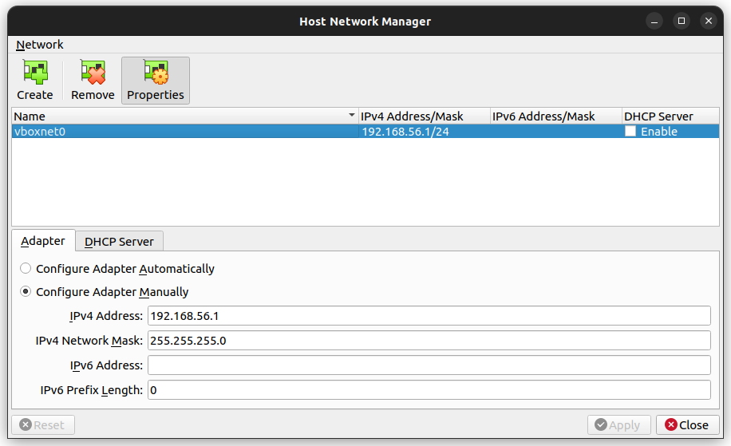

- Добавляем в VirtualBox виртуальный образ `HR_SDK.vbox` \
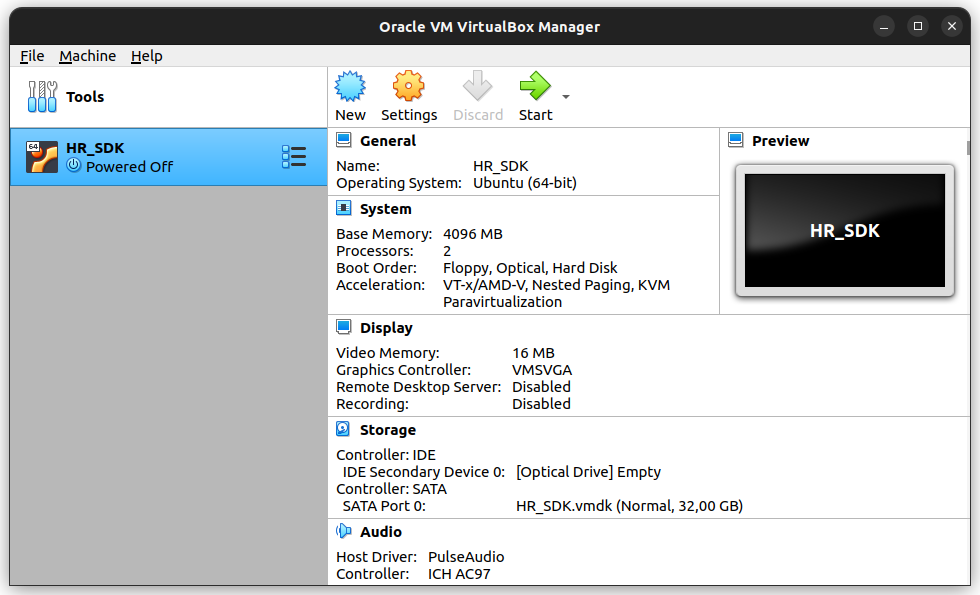

- В свойствах `Network` выбираем `Host-only Adapter` \
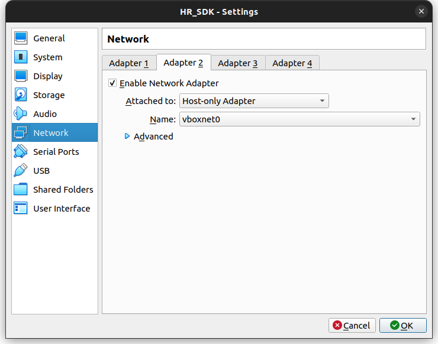

- Запускаем виртуальную машину \
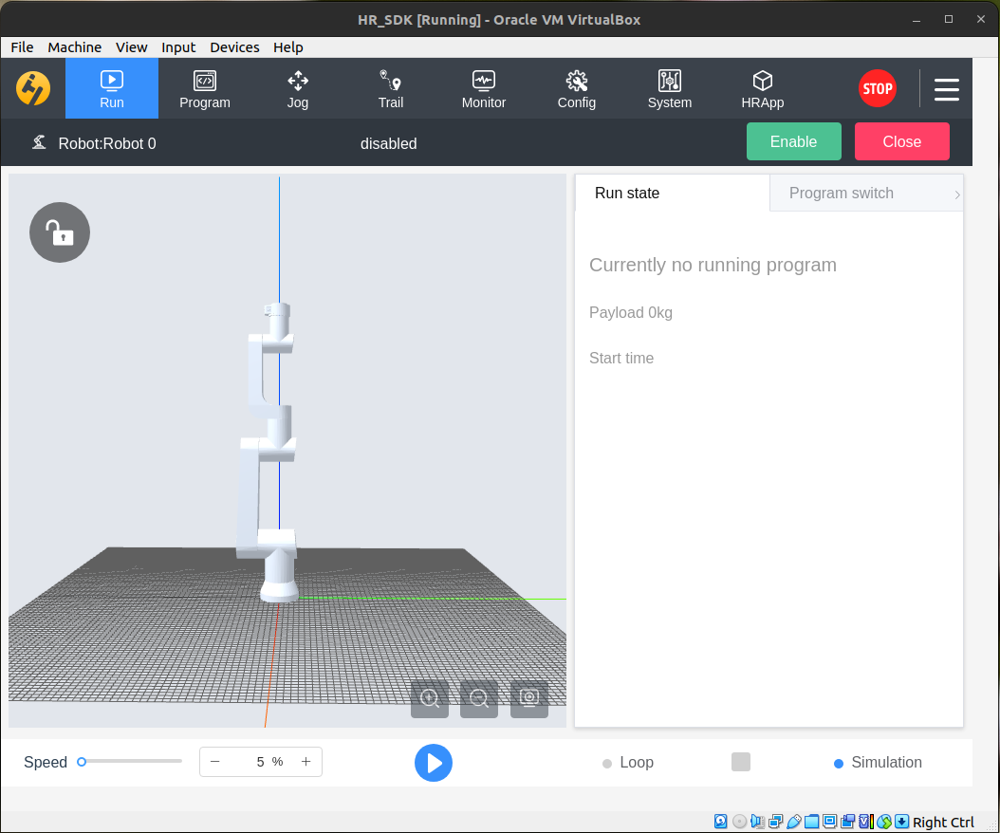

- Задаем статичные настройки `ip` и `gw` \
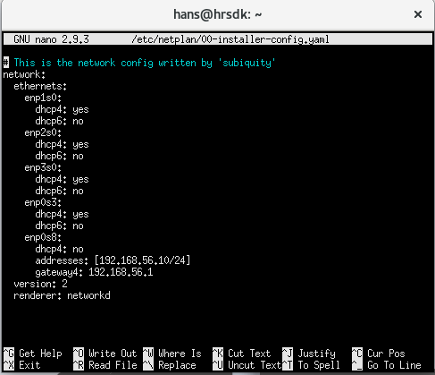 \
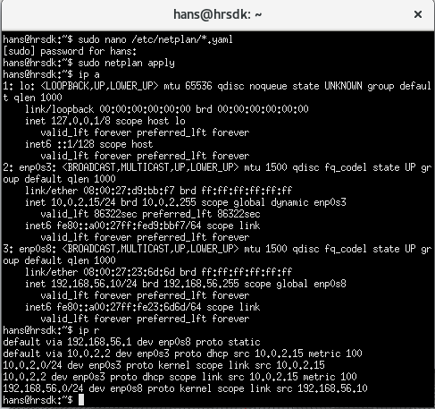

- Проверяем соединение и копируем динамическую библиотеку в `/usr/lib/` \
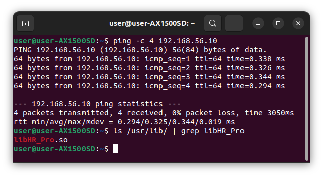

- Клиент разработан на языке С++ \
Код программы находится в папке src \
При написании кода придерживался Google Style

### Результаты выполненного задания

- HR = Blackout - thr electrify = 0 \
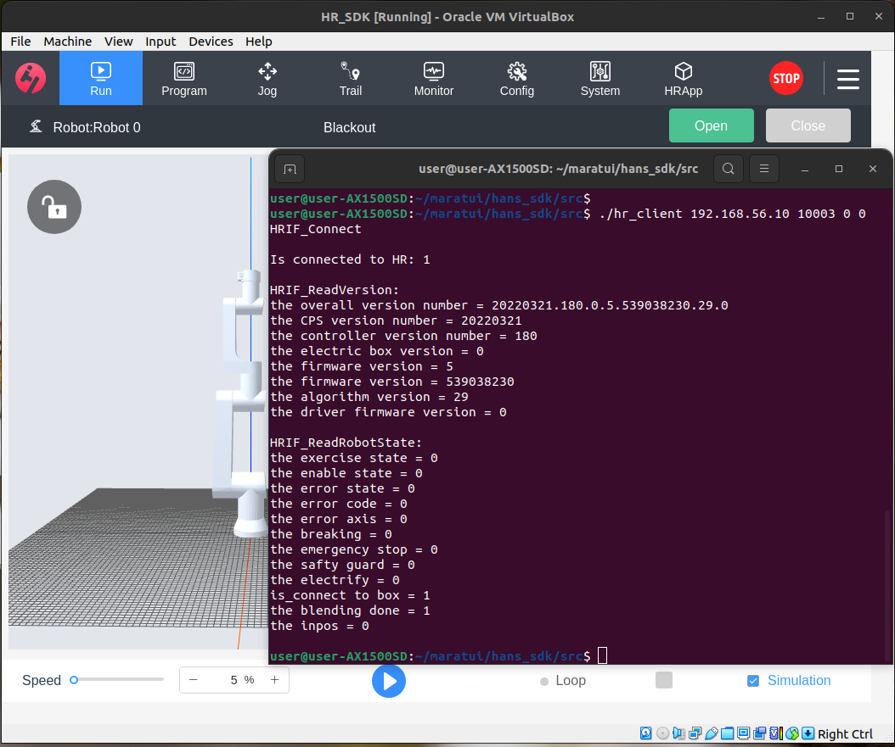

- HR = disabled - the electrify = 1; the enable state = 0 \
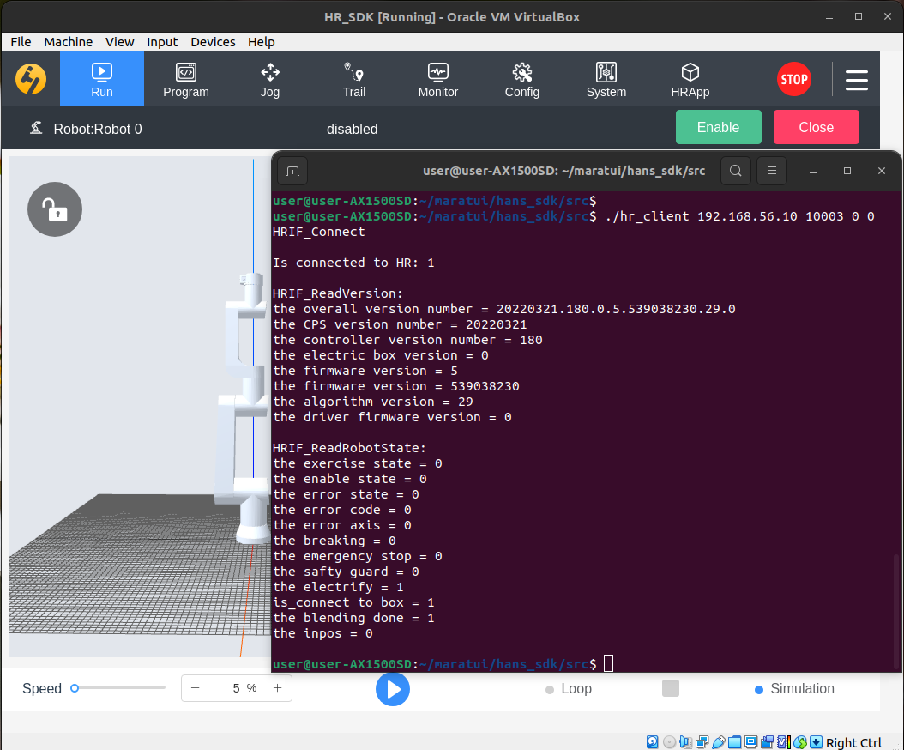

- HR = error - the error state = 1; the error code = 15296; the error axis = 1 \
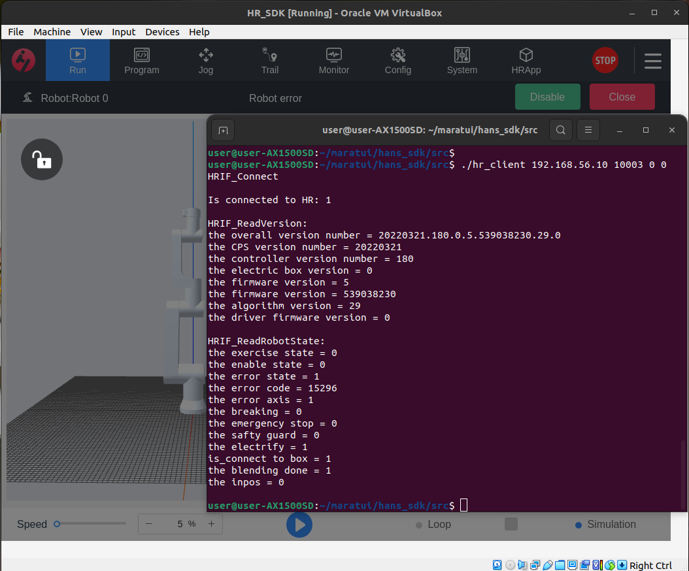

- HR is in standby state - the enable state = 1; the exercise state = 0 \
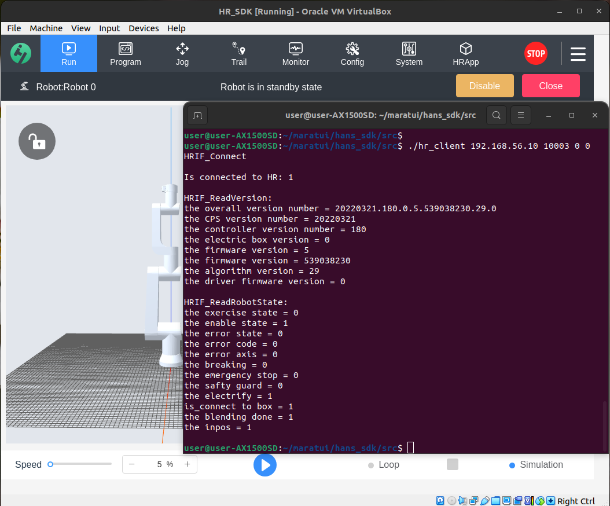

- HR = Script running - the exercise state = 1 \
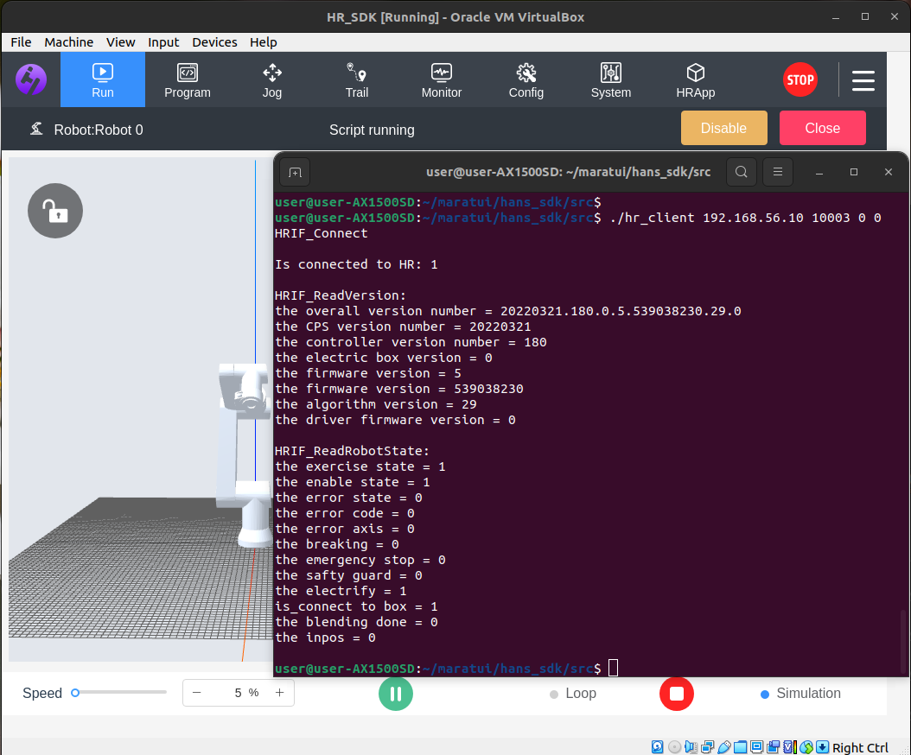
